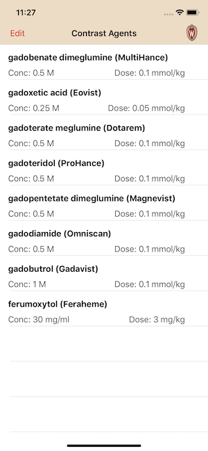
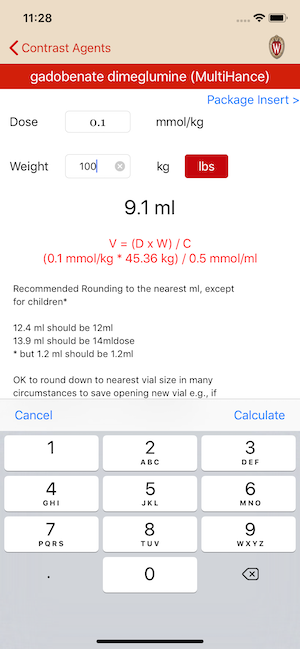
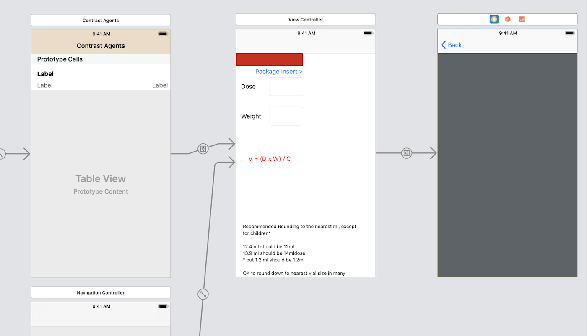

# Gadolinium
Description: Recreate an iPhone app built in C# into a fully dynamic Swift mobile app

Functionality:
- Display a list of gadolinium agents used by UW Technologists
- Calculate dose using recommended Contrast Agent dose using the patients weight
- Use Alerts to notify if outside recommended dose
- Sortable/deletable contrast agents on the table view 
- Provide Link to Gadolinium Dose Med Library

